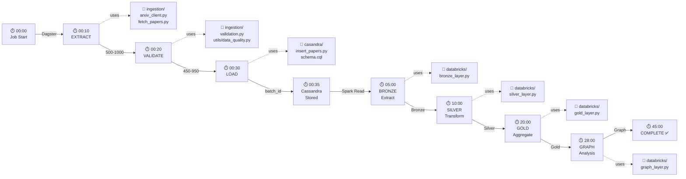
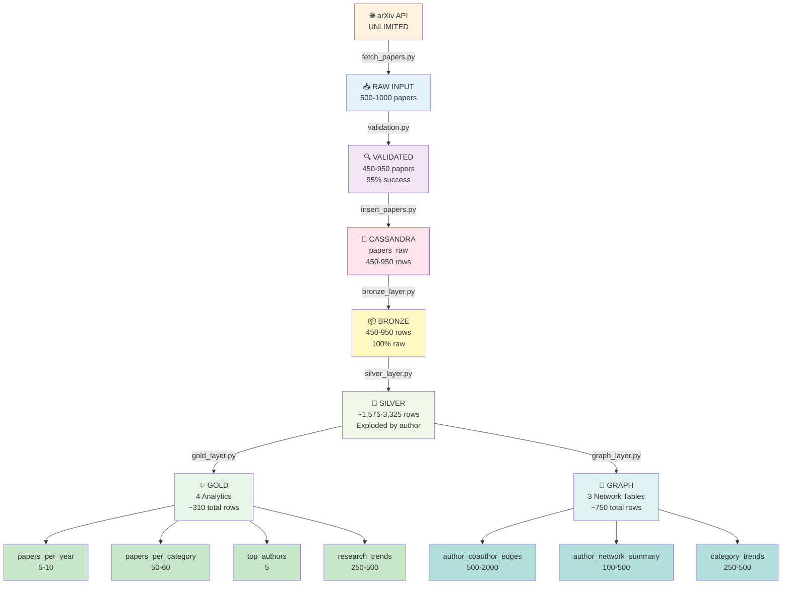
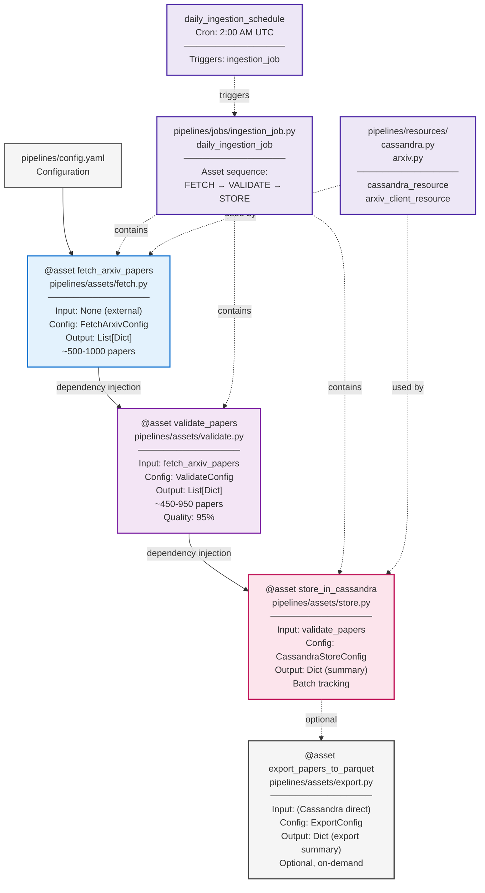

# 📊 Diagrama Mermaid Completo ETL+ELT avec Tous les Fichiers

## Architecture Complete Flow with File References

```mermaid
graph TB
    subgraph ARXIV["🌐 ARXIV API"]
        API["arXiv.org REST API<br/>Research Papers"]
    end
    
    subgraph ETL_EXTRACT["📥 ETL EXTRACT<br/>ingestion/"]
        CLIENT["arxiv_client.py<br/>ArxivClient class<br/>search_papers()"]
        FETCHER["fetch_papers.py<br/>PaperFetcher<br/>500-1000 papers"]
    end
    
    subgraph DAGSTER_FETCH["🎯 DAGSTER - FETCH ASSET<br/>pipelines/assets/"]
        FETCH_ASSET["fetch.py<br/>@asset fetch_arxiv_papers<br/>FetchArxivConfig<br/>Retry + Circuit Breaker"]
    end
    
    subgraph ETL_TRANSFORM["🔍 ETL TRANSFORM<br/>ingestion/"]
        VALIDATOR["validation.py<br/>PaperModel Pydantic<br/>DataQualityValidator<br/>13 field schema"]
    end
    
    subgraph DAGSTER_VALIDATE["🎯 DAGSTER - VALIDATE ASSET<br/>pipelines/assets/"]
        VALIDATE_ASSET["validate.py<br/>@asset validate_papers<br/>ValidateConfig<br/>450-950 valid papers<br/>95% success rate"]
    end
    
    subgraph ETL_LOAD["💾 ETL LOAD<br/>casandra/"]
        INSERT["insert_papers.py<br/>Chunk & Insert via cqlsh<br/>batch_id tracking"]
    end
    
    subgraph DAGSTER_STORE["🎯 DAGSTER - STORE ASSET<br/>pipelines/assets/"]
        STORE_ASSET["store.py<br/>@asset store_in_cassandra<br/>CassandraStoreConfig<br/>Summary output"]
    end
    
    subgraph CASSANDRA["💾 CASSANDRA DATABASE<br/>Docker Service"]
        DB["cassandra_arxiv<br/>keyspace: arxiv<br/>table: papers_raw<br/>450-950 records"]
        SCHEMA["schema.cql<br/>13 columns + batch_id"]
    end
    
    subgraph ELT_BRONZE["📦 ELT BRONZE LAYER<br/>databricks/"]
        BRONZE["bronze_layer.py<br/>Extract: Cassandra→Parquet<br/>Add metadata columns<br/>450-950 rows<br/>Path: /mnt/data/papers_bronze_parquet"]
    end
    
    subgraph ELT_SILVER["🧹 ELT SILVER LAYER<br/>databricks/"]
        SILVER["silver_layer.py<br/>Transform: Clean & Enrich<br/>• dropDuplicates(arxiv_id)<br/>• trim(title,abstract)<br/>• to_timestamp(dates)<br/>• year(published_date)<br/>• Metrics: lengths, counts<br/>• EXPLODE authors<br/>~1,575-3,325 rows<br/>Path: /mnt/data/papers_silver_parquet"]
    end
    
    subgraph ELT_GOLD["✨ ELT GOLD LAYER<br/>databricks/"]
        GOLD["gold_layer.py<br/>Aggregate: 4 Analytics Tables<br/>• papers_per_year (5-10)<br/>• papers_per_category (50-60)<br/>• top_authors (5)<br/>• research_trends (250-500)<br/>With growth_rate calculation<br/>Path: /mnt/data/papers_gold/"]
    end
    
    subgraph ELT_GRAPH["🔗 ELT GRAPH LAYER<br/>databricks/"]
        GRAPH["graph_layer.py<br/>Network Analysis: 3 Tables<br/>• author_coauthor_edges<br/>  (500-2000 pairs)<br/>• author_network_summary<br/>  (100-500 nodes)<br/>• category_trends (250-500)<br/>Path: /mnt/data/papers_graph/"]
    end
    
    subgraph EXPORT["📤 EXPORT<br/>scripts/"]
        EXPORT_SCRIPT["export_to_parquet.py<br/>Export Cassandra→Parquet<br/>Optional on-demand"]
    end
    
    subgraph VISUALIZATION["📈 VISUALIZATION LAYER"]
        DATABRICKS["💼 Databricks<br/>SQL Queries<br/>Dashboards"]
        STREAMLIT["🎨 Streamlit/Dash<br/>Python Web App<br/>Real-time UI"]
        BI["📊 BI Tools<br/>Power BI / Tableau<br/>Advanced Analytics"]
    end
    
    subgraph ORCHESTRATION["🎯 ORCHESTRATION<br/>pipelines/"]
        PIPELINE["dagster_pipeline.py<br/>Main entrypoint<br/>Load assets + resources"]
        CONFIG["config.yaml<br/>Pipeline configuration"]
        JOBS["jobs/ingestion_job.py<br/>daily_ingestion_job<br/>asset sequence"]
        SCHEDULE["daily_ingestion_schedule<br/>@ 2:00 AM UTC"]
        DAGIT["Dagit UI<br/>localhost:3000<br/>Asset tracking"]
    end
    
    subgraph DOCKER["🐳 DOCKER COMPOSE"]
        COMPOSE["docker-compose.yml<br/>Cassandra service<br/>Kafka service<br/>PostgreSQL service<br/>Networks"]
    end
    
    subgraph MONITORING["📊 MONITORING & LOGGING"]
        LOGS["utils/logging_config.py<br/>JSON structured logs<br/>Batch context tracking"]
        METRICS["prometheus metrics<br/>Health checks<br/>Performance tracking"]
    end
    
    %% ETL Phase Connections
    API -->|HTTP GET| CLIENT
    CLIENT -->|search_papers()| FETCHER
    FETCHER -->|500-1000 papers| FETCH_ASSET
    
    FETCH_ASSET -->|fetch_arxiv_papers| VALIDATE_ASSET
    VALIDATE_ASSET -->|Pydantic schema| VALIDATOR
    VALIDATOR -->|450-950 valid| VALIDATE_ASSET
    VALIDATE_ASSET -->|validate_papers| STORE_ASSET
    STORE_ASSET -->|insert_papers()| INSERT
    INSERT -->|docker cqlsh| INSERT
    
    INSERT -->|batch_id tracking| DB
    SCHEMA -->|schema| DB
    
    %% Orchestration Connections
    PIPELINE -->|loads| JOBS
    CONFIG -->|configures| PIPELINE
    JOBS -->|contains| FETCH_ASSET
    JOBS -->|→| VALIDATE_ASSET
    JOBS -->|→| STORE_ASSET
    SCHEDULE -->|triggers| JOBS
    JOBS -->|tracked in| DAGIT
    
    %% Docker Connections
    COMPOSE -->|defines| DB
    
    %% Monitoring Connections
    FETCH_ASSET -->|logs| LOGS
    VALIDATE_ASSET -->|logs| LOGS
    STORE_ASSET -->|logs| LOGS
    JOBS -->|metrics| METRICS
    
    %% ELT Phase Connections
    DB -->|read| BRONZE
    BRONZE -->|450-950 rows| SILVER
    SILVER -->|~1,575-3,325 rows| GOLD
    SILVER -->|~1,575-3,325 rows| GRAPH
    
    %% Export Connection
    DB -->|optional| EXPORT_SCRIPT
    
    %% Visualization Connections
    GOLD -->|parquet files| DATABRICKS
    GOLD -->|parquet files| STREAMLIT
    GOLD -->|parquet files| BI
    GRAPH -->|parquet files| DATABRICKS
    GRAPH -->|parquet files| STREAMLIT
    GRAPH -->|parquet files| BI
    
    %% Styling
    classDef external fill:#fff3e0,stroke:#f57c00,stroke-width:3px,color:#000
    classDef extract fill:#e3f2fd,stroke:#1976d2,stroke-width:2px,color:#000
    classDef transform fill:#f3e5f5,stroke:#7b1fa2,stroke-width:2px,color:#000
    classDef load fill:#fce4ec,stroke:#c2185b,stroke-width:2px,color:#000
    classDef dagster fill:#ede7f6,stroke:#512da8,stroke-width:2px,color:#000
    classDef storage fill:#e0f2f1,stroke:#00796b,stroke-width:2px,color:#000
    classDef bronze fill:#fff9c4,stroke:#f57f17,stroke-width:2px,color:#000
    classDef silver fill:#f1f8e9,stroke:#558b2f,stroke-width:2px,color:#000
    classDef gold fill:#e8f5e9,stroke:#388e3c,stroke-width:2px,color:#000
    classDef graph fill:#e0f2f1,stroke:#00897b,stroke-width:2px,color:#000
    classDef export fill:#f5f5f5,stroke:#424242,stroke-width:2px,color:#000
    classDef viz fill:#fbe9e7,stroke:#d84315,stroke-width:2px,color:#000
    classDef orch fill:#ede7f6,stroke:#512da8,stroke-width:2px,color:#000
    classDef docker fill:#e0f2f1,stroke:#00796b,stroke-width:2px,color:#000
    classDef monitor fill:#f1f8e9,stroke:#558b2f,stroke-width:2px,color:#000
    
    class API external
    class CLIENT,FETCHER extract
    class VALIDATOR transform
    class INSERT load
    class FETCH_ASSET,VALIDATE_ASSET,STORE_ASSET,PIPELINE,JOBS,SCHEDULE,DAGIT dagster
    class DB,SCHEMA storage
    class BRONZE bronze
    class SILVER silver
    class GOLD gold
    class GRAPH graph
    class EXPORT_SCRIPT export
    class DATABRICKS,STREAMLIT,BI viz
    class CONFIG,FETCH_ASSET,VALIDATE_ASSET,STORE_ASSET orch
    class COMPOSE docker
    class LOGS,METRICS monitor
```

---

## 📋 Sequential Execution Timeline with Files



---

## 📊 Data Volume Transformation with Files



---

## 🔄 Dagster Asset Dependency Graph



---

## 💾 Cassandra to Spark Data Pipeline

```mermaid
graph LR
    CAS["💾 CASSANDRA<br/>papers_raw"]
    
    CONN["Spark-Cassandra<br/>Connector v3.4.1<br/>────────────────<br/>spark-cassandra-connector<br/>_2.12:3.4.1"]
    
    BRONZE_READ["BRONZE READ<br/>databricks/bronze_layer.py<br/>────────────────<br/>spark.read<br/>.format('cassandra')<br/>.options(keyspace, table)<br/>.load()"]
    
    BRONZE_WRITE["BRONZE WRITE<br/>────────────────<br/>Write to Parquet<br/>Path: /mnt/data/papers_bronze<br/>Mode: overwrite<br/>Format: Parquet"]
    
    BRONZE_PATH["📁 /mnt/data/papers_bronze_parquet<br/>450-950 rows"]
    
    SILVER_READ["SILVER READ<br/>databricks/silver_layer.py<br/>────────────────<br/>spark.read<br/>.format('parquet')<br/>.load(BRONZE_PATH)"]
    
    SILVER_TRANSFORM["SILVER TRANSFORM<br/>────────────────<br/>• dropDuplicates<br/>• trim • to_timestamp<br/>• year extraction<br/>• metrics calculation<br/>• explode authors"]
    
    SILVER_WRITE["SILVER WRITE<br/>Path: /mnt/data/papers_silver<br/>~1,575-3,325 rows"]
    
    SILVER_PATH["📁 /mnt/data/papers_silver_parquet<br/>Exploded by author"]
    
    CAS -->|Connector| CONN
    CONN -->|Read| BRONZE_READ
    BRONZE_READ -->|500-1000| BRONZE_WRITE
    BRONZE_WRITE -->|Save| BRONZE_PATH
    
    BRONZE_PATH -->|Read| SILVER_READ
    SILVER_READ -->|Transform| SILVER_TRANSFORM
    SILVER_TRANSFORM -->|Write| SILVER_WRITE
    SILVER_WRITE -->|Save| SILVER_PATH
    
    style CAS fill:#fce4ec,stroke:#c2185b,stroke-width:2px
    style CONN fill:#e0f2f1,stroke:#00796b,stroke-width:2px
    style BRONZE_READ fill:#fff9c4,stroke:#f57f17,stroke-width:2px
    style BRONZE_WRITE fill:#fff9c4,stroke:#f57f17,stroke-width:2px
    style BRONZE_PATH fill:#fff9c4,stroke:#f57f17,stroke-width:2px
    style SILVER_READ fill:#f1f8e9,stroke:#558b2f,stroke-width:2px
    style SILVER_TRANSFORM fill:#f1f8e9,stroke:#558b2f,stroke-width:2px
    style SILVER_WRITE fill:#f1f8e9,stroke:#558b2f,stroke-width:2px
    style SILVER_PATH fill:#f1f8e9,stroke:#558b2f,stroke-width:2px
```



---

## 📋 File Directory Structure with Data Flow

```
research-papers-pipeline/
│
├── 🌐 EXTRACTION PHASE
│   ├── ingestion/
│   │   ├── __init__.py
│   │   ├── arxiv_client.py          ← ArxivClient (API client)
│   │   ├── fetch_papers.py          ← PaperFetcher (batch fetch)
│   │   └── validation.py            ← PaperModel + validators
│   │
│   └── 🎯 Dagster Assets
│       └── pipelines/assets/
│           ├── fetch.py             ← @asset fetch_arxiv_papers
│           ├── validate.py          ← @asset validate_papers
│           ├── store.py             ← @asset store_in_cassandra
│           └── export.py            ← @asset export_papers_to_parquet
│
├── 💾 ETL LOAD PHASE
│   ├── casandra/
│   │   ├── cassandra_connection.py
│   │   ├── insert_papers.py         ← Docker cqlsh insert
│   │   └── schema.cql               ← Table schema
│   │
│   └── 🐳 Docker
│       ├── docker-compose.yml       ← Cassandra service
│       └── Dockerfile               ← Container image
│
├── 🎯 ORCHESTRATION
│   ├── pipelines/
│   │   ├── dagster_pipeline.py      ← Main entrypoint
│   │   ├── config.yaml              ← Configuration
│   │   ├── jobs/
│   │   │   └── ingestion_job.py    ← Daily job
│   │   ├── resources/
│   │   │   ├── arxiv.py            ← arXiv resource
│   │   │   └── cassandra.py        ← Cassandra resource
│   │   └── assets/
│   │       └── (assets listed above)
│   │
│   └── scripts/
│       ├── launch_dagit.py          ← Start UI
│       └── run_ingestion.py         ← CLI runner
│
├── 📊 ELT ANALYTICS PHASE
│   ├── databricks/
│   │   ├── bronze_layer.py          ← Extract → Parquet
│   │   ├── silver_layer.py          ← Transform
│   │   ├── gold_layer.py            ← Aggregate (4 tables)
│   │   └── graph_layer.py           ← Network (3 tables)
│   │
│   └── scripts/
│       ├── export_to_parquet.py     ← On-demand export
│       └── run_spark_pipeline.sh    ← Spark wrapper
│
├── 📚 UTILITIES
│   └── utils/
│       ├── __init__.py
│       ├── logging_config.py        ← JSON logging
│       ├── error_handling.py        ← Exception management
│       └── data_quality.py          ← Quality validators
│
├── 📄 CONFIGURATION
│   ├── requirements.txt             ← Python dependencies
│   ├── .env.example                 ← Environment template
│   └── docker-compose.yml           ← Container orchestration
│
└── 📋 DOCUMENTATION
    ├── README.md                    ← Project overview
    ├── HOW_TO_RUN.md               ← Setup guide
    ├── QUICK_START.md              ← Fast setup
    ├── PROJECT_STATUS.md           ← Status tracking
    ├── ARCHITECTURE_ETL_ELT_COMPLETE.md  ← This document
    │
    └── docs/
        ├── architecture.md          ← System design
        ├── architecture_diagram.md  ← Visuals
        ├── dagster_architecture.md  ← Orchestration design
        ├── data_model.md           ← Database schema
        └── pipeline_design.md      ← Pipeline flow
```

---

**This diagram shows:**
- ✅ All files with their exact locations
- ✅ ETL/ELT phases with file mappings
- ✅ Data transformations and record counts
- ✅ Orchestration with Dagster assets
- ✅ Cassandra to Spark pipeline
- ✅ Complete execution timeline
