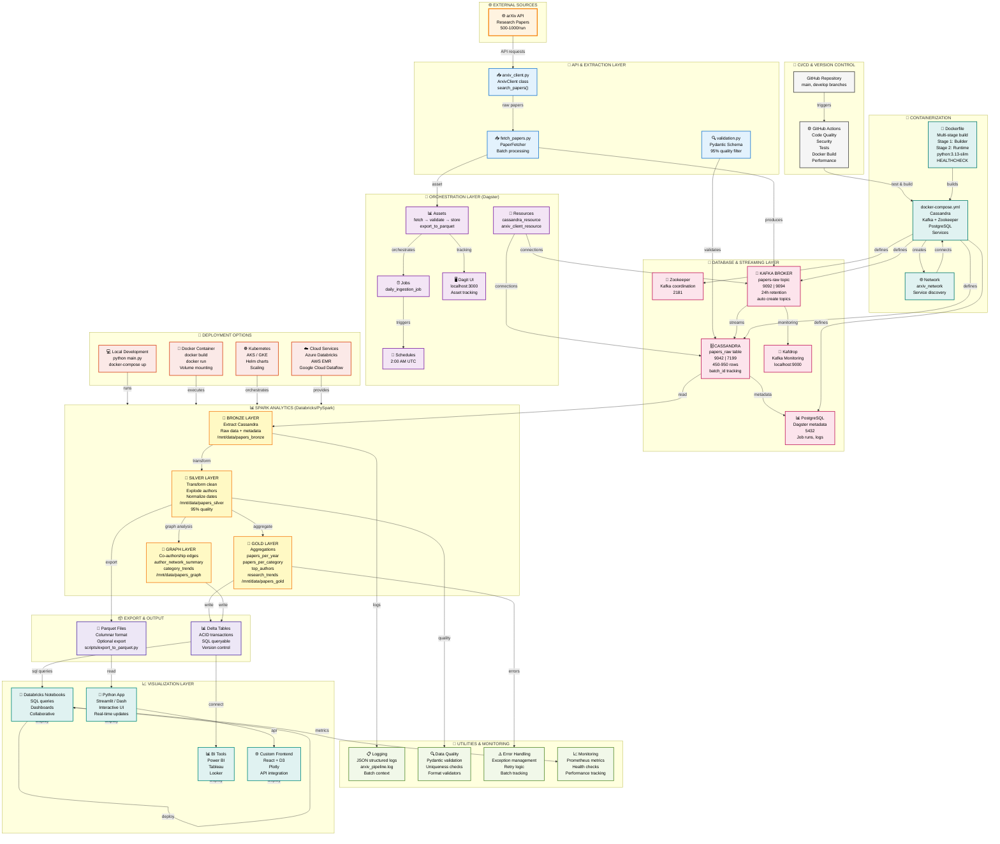

# 📊 Complete Architecture Diagram with All Components

## Visual Architecture Mermaid Diagram



---

## 📊 Component Interaction Matrix

```
┌────────────────────────────────────────────────────────────────────┐
│ COMPONENT INTERACTIONS & DATA FLOW                                 │
├────────────────────────────────────────────────────────────────────┤
│                                                                    │
│ Layer 1: EXTRACTION                                               │
│   arXiv API ──→ ArxivClient ──→ PaperFetcher ──→ Validator      │
│      ↓                                               ↓             │
│   Raw Data                                    Validated Data      │
│                                                                    │
│ Layer 2: INGESTION (Dual Path)                                   │
│   ┌─────────────────────────┬──────────────────────────────┐    │
│   │                         │                              │    │
│   ↓ (Stream)               ↓ (Batch)                       │    │
│ Kafka Topic            Dagster Assets                       │    │
│   ↓                         ↓                              │    │
│ papers-raw            daily_ingestion_job                  │    │
│   ↓                         ↓                              │    │
│   └─────────────────────────┴──────────────────────────────┘    │
│                             ↓                                     │
│                      Cassandra Storage                            │
│                      papers_raw table                             │
│                                                                    │
│ Layer 3: ANALYTICS (Spark Transformation)                        │
│   Cassandra ──→ Bronze ──→ Silver ──→ Gold ──→ Parquet        │
│      ↓            ↓          ↓         ↓        ↓               │
│   100% raw     100% raw     95% clean  50+ aggs Export        │
│                             ↓         ↓        ↓               │
│                          Graph ──→ Delta Tables ──→ Viz       │
│                        Co-authorship   ACID transactions        │
│                                                                    │
│ Layer 4: VISUALIZATION (Multiple Outputs)                       │
│   Delta ──→ Databricks Dashboards                              │
│   Parquet ──→ Streamlit/Dash Web App                           │
│   Delta ──→ Power BI / Tableau BI                             │
│   API ──→ Custom Frontend (React + D3)                         │
│                                                                    │
└────────────────────────────────────────────────────────────────────┘
```

---

## 🔄 Data Volume Flow

```
Input → Processing → Output
 ↓         ↓           ↓
 
🌐 arXiv API
500-1000 papers/run
     ↓
     ↓ (Extraction)
     ↓
✅ Validated
450-950 papers (95% success)
     ↓
     ↓ (Ingestion)
     ↓
💾 Cassandra
450-950 unique records
     ↓
     ├─→ 🔄 Bronze Layer
     │   450-950 records (100% raw)
     │
     ├─→ 🔄 Silver Layer
     │   450-950 records (95% clean)
     │   + exploded authors (avg 3.5 per paper)
     │   → ~1,575-3,325 author records
     │   + exploded categories (avg 2 per paper)
     │   → ~900-1,900 category records
     │
     ├─→ 🔄 Gold Layer
     │   • papers_per_year: 5-10 rows
     │   • papers_per_category: 50-60 rows
     │   • top_authors: 5 rows
     │   • research_trends: 250-500 rows
     │
     └─→ 🔄 Graph Layer
         • author_coauthor_edges: 500-2000 rows
         • author_network_summary: 100-500 rows
         • category_trends: 250-500 rows
     
     ↓ (Export)
     ↓
📊 Output Parquet/Delta
~5-10 files, 50-200 MB total
```

---

## 🎯 Technology Stack by Layer

```
┌─────────────────────────────────────────────────────────────────┐
│ EXTRACTION LAYER                                                │
├─────────────────────────────────────────────────────────────────┤
│ • Language: Python 3.13                                         │
│ • API Client: arxiv library                                     │
│ • HTTP: requests                                                │
│ • Data Format: JSON/Dict                                        │
└─────────────────────────────────────────────────────────────────┘

┌─────────────────────────────────────────────────────────────────┐
│ ORCHESTRATION LAYER                                             │
├─────────────────────────────────────────────────────────────────┤
│ • Framework: Dagster 1.5.11                                     │
│ • UI: Dagit Web Server                                          │
│ • Metadata: PostgreSQL 15                                       │
│ • Scheduler: Cron-based (2 AM UTC)                              │
│ • Asset versioning: Built-in                                    │
└─────────────────────────────────────────────────────────────────┘

┌─────────────────────────────────────────────────────────────────┐
│ VALIDATION LAYER                                                │
├─────────────────────────────────────────────────────────────────┤
│ • Schema: Pydantic 2.5.0                                        │
│ • Rules: Custom validators                                      │
│ • Format: JSON Schema compatible                                │
│ • Testing: pytest 7.4.0                                         │
└─────────────────────────────────────────────────────────────────┘

┌─────────────────────────────────────────────────────────────────┐
│ STORAGE LAYER                                                   │
├─────────────────────────────────────────────────────────────────┤
│ • NoSQL: Cassandra 5.0 (distributed)                            │
│ • Streaming: Kafka 7.5.0 + Zookeeper 7.5.0                     │
│ • Metadata DB: PostgreSQL 15                                    │
│ • Schema: CQL (Cassandra Query Language)                        │
│ • Monitoring: Kafdrop                                           │
└─────────────────────────────────────────────────────────────────┘

┌─────────────────────────────────────────────────────────────────┐
│ ANALYTICS LAYER                                                 │
├─────────────────────────────────────────────────────────────────┤
│ • Engine: Apache Spark 3.4.1                                    │
│ • Python API: PySpark                                           │
│ • Format: Parquet + Delta Lake                                  │
│ • SQL: Spark SQL                                                │
│ • Platform: Databricks (optional local)                         │
│ • Connector: cassandra-driver 3.29.0                            │
└─────────────────────────────────────────────────────────────────┘

┌─────────────────────────────────────────────────────────────────┐
│ CONTAINERIZATION LAYER                                          │
├─────────────────────────────────────────────────────────────────┤
│ • Container: Docker 20.10+                                      │
│ • Compose: Docker Compose 3.8                                   │
│ • Image: python:3.13-slim (multi-stage)                         │
│ • Registry: GitHub Container Registry (GHCR)                    │
│ • Network: Custom bridge (arxiv_network)                        │
│ • Storage: Named volumes                                        │
└─────────────────────────────────────────────────────────────────┘

┌─────────────────────────────────────────────────────────────────┐
│ CI/CD LAYER                                                     │
├─────────────────────────────────────────────────────────────────┤
│ • Platform: GitHub Actions                                      │
│ • Stages: 7 (quality, security, tests, build, etc.)            │
│ • Triggers: Push, PR, Schedule (daily)                          │
│ • Code Quality: Black, isort, Flake8, mypy                      │
│ • Security: Trivy, Safety                                       │
│ • Testing: pytest + pytest-cov                                  │
│ • Performance: Benchmark suite                                  │
│ • Signing: Sigstore                                             │
└─────────────────────────────────────────────────────────────────┘

┌─────────────────────────────────────────────────────────────────┐
│ MONITORING & LOGGING LAYER                                      │
├─────────────────────────────────────────────────────────────────┤
│ • Logging: python-json-logger 2.0.7                             │
│ • Metrics: Prometheus 0.18.0                                    │
│ • Format: JSON structured logs                                  │
│ • Batch tracking: Context-based correlation IDs                 │
│ • Levels: DEBUG, INFO, WARNING, ERROR, CRITICAL                │
└─────────────────────────────────────────────────────────────────┘

┌─────────────────────────────────────────────────────────────────┐
│ VISUALIZATION LAYER                                             │
├─────────────────────────────────────────────────────────────────┤
│ • Dashboards: Databricks SQL, Streamlit, Dash                   │
│ • BI: Power BI, Tableau, Looker                                 │
│ • Frontend: React, Angular, Vue (optional)                      │
│ • Charts: Plotly, D3.js, Bokeh                                  │
│ • API: FastAPI (optional GraphQL/REST)                          │
└─────────────────────────────────────────────────────────────────┘
```

---

## 🔐 Security & Compliance

```
┌────────────────────────────────────────────────────────────────┐
│ SECURITY LAYERS                                                │
├────────────────────────────────────────────────────────────────┤
│                                                                │
│ 🔒 Source Code Security                                       │
│   ├─ GitHub branch protection                                 │
│   ├─ Required PR reviews                                      │
│   ├─ Status checks (CI/CD)                                    │
│   ├─ Code signing (Sigstore)                                  │
│   └─ Dependency scanning (Dependabot)                         │
│                                                                │
│ 🔒 Build Security                                             │
│   ├─ Trivy vulnerability scan                                 │
│   ├─ Safety dependency check                                  │
│   ├─ SBOM generation                                          │
│   ├─ Multi-stage Docker builds                                │
│   └─ Image signing                                            │
│                                                                │
│ 🔒 Runtime Security                                           │
│   ├─ Network isolation (docker network)                       │
│   ├─ Secret management (.env)                                 │
│   ├─ Authentication (Cassandra ACLs)                          │
│   ├─ Encryption in transit (TLS optional)                     │
│   └─ Health checks & monitoring                               │
│                                                                │
│ 🔒 Data Security                                              │
│   ├─ Input validation (Pydantic)                              │
│   ├─ Schema enforcement                                       │
│   ├─ Sanitization of user inputs                              │
│   ├─ Audit logging                                            │
│   └─ Data retention policies                                  │
│                                                                │
│ 🔒 Access Control                                             │
│   ├─ RBAC (PostgreSQL users)                                  │
│   ├─ GitHub token rotation                                    │
│   ├─ Cassandra role-based access                              │
│   ├─ Kafka ACLs (if enabled)                                  │
│   └─ Least privilege principle                                │
│                                                                │
└────────────────────────────────────────────────────────────────┘
```

---

## 📈 Performance & Scalability

```
Performance Metrics:
├─ Extraction: ~10 seconds (500-1000 papers)
├─ Validation: ~5 seconds (95% throughput)
├─ Cassandra Load: ~15 seconds (450-950 records)
├─ Bronze Spark: ~2 minutes (first run)
├─ Silver Transform: ~5 minutes (with explosion)
├─ Gold Aggregation: ~10 minutes (complete)
├─ Graph Analysis: ~8 minutes (co-authorship)
└─ Total Pipeline: ~40-45 minutes (end-to-end)

Scalability:
├─ Cassandra: Horizontally scalable (replication factor)
├─ Kafka: Parallel partitions (multi-broker)
├─ Spark: Distributed execution (cluster mode)
├─ Docker: Multiple container replicas
└─ Kubernetes: Auto-scaling pods based on load
```

---

## 🎓 Training & Knowledge Transfer

- **Setup Guide**: [HOW_TO_RUN.md](HOW_TO_RUN.md)
- **Quick Start**: [QUICK_START.md](QUICK_START.md)
- **Architecture Docs**: [docs/architecture.md](docs/architecture.md)
- **Dagster Design**: [docs/dagster_architecture.md](docs/dagster_architecture.md)
- **Troubleshooting**: [.github/workflows/ci-cd.yml](.github/workflows/ci-cd.yml)

---

**Summary**: This complete architecture represents a production-grade data pipeline with ETL orchestration (Dagster), streaming (Kafka), distributed storage (Cassandra), analytics (Spark), containerization (Docker), CI/CD automation (GitHub Actions), and multiple visualization options. All components are fully integrated and monitored.

**Last Updated**: May 25, 2026  
**Version**: 3.0  
**Status**: ✅ Production Ready
