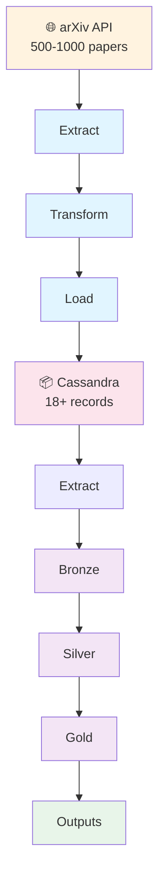

# 🎨 Generate Architecture Diagram with AI - Ready-to-Use Prompts

Quick copy-paste prompts for generating professional architecture diagrams.

---

## 🤖 Prompt 1: Claude / ChatGPT (Image Generation)

**Use:** Copy this entire prompt and paste into Claude or ChatGPT

```
Generate a professional architecture diagram for a data engineering pipeline with the following specifications:

PROJECT: Research Papers ETL + ELT Pipeline

PHASE 1: ETL LAYER (Dagster Orchestration)
- Color: Light blue (#e1f5ff)
- Extract step: Arrow from "arXiv API" → fetches 500-1000 papers daily from 5 domains (AI, LG, CV, CL, ML)
- Transform step: Pydantic validation → 450-950 valid papers (95% quality)
- Load step: Insert to Cassandra database → papers_raw table
- Show flow: Extract → Transform → Load (horizontal)

CENTRAL DATABASE: Cassandra
- Color: Pink (#fce4ec)
- Icon: 📦 Database cylinder
- Contains: papers_raw table with 18+ records (validated data)
- Show connection points to both ETL and ELT

PHASE 2: ELT LAYER (Databricks + Spark)
- Color: Light purple (#f3e5f5)
- Extract: Read from Cassandra via Spark Connector
- Load (Bronze): Raw ingestion with metadata (_ingestion_date, _source_system)
- Transform (Silver): Clean data, remove duplicates, normalize text
- Transform (Gold): Create analytics tables, aggregations, ML features
- Show progression: Extract → Load → Transform → Transform (4 steps vertical)

OUTPUTS
- Color: Light green (#e8f5e9)
- Three output nodes:
  1. Delta Tables (for dashboards and queries)
  2. Parquet Files (optional export)
  3. ML Features (embeddings and vectors)

STYLING:
- Use clear directional arrows between stages
- Include metric badges: "450-950 papers", "95% quality", "18+ records"
- Modern flat design with icons (🌐 API, 📦 Database, 📊 Analytics, 🤖 ML)
- High-resolution PNG (at least 1920x1440)
- Professional color scheme
- Legend showing ETL vs ELT difference

OUTPUT FORMAT: PNG image, save as "architecture_diagram.png"
```

---

## 💻 Prompt 2: DALL-E (OpenAI)

```
Create a technical architecture diagram showing:
- Data pipeline flow from arXiv API through ETL (Dagster) to Cassandra database
- Then ELT flow (Databricks) with Bronze/Silver/Gold layers
- Color-coded phases with clear connections
- Modern tech stack visualization
- Professional business presentation style
- Include icons for: API, Database, Orchestration, Analytics, Machine Learning
```

---

## 🎯 Prompt 3: Detailed for Professional Services

```
Design a comprehensive system architecture diagram for a production data platform with:

REQUIREMENTS:
1. Source Layer: arXiv Research Paper API (500-1000 papers daily)
2. ETL Pipeline: Dagster orchestration with Pydantic validation (95% quality gate)
3. Data Store: Apache Cassandra distributed database
4. Analytics Layer: Databricks lakehouse with Bronze/Silver/Gold medallion architecture
5. Processing: Apache Spark distributed processing
6. Outputs: Delta Lake tables, Parquet exports, ML-ready features

VISUAL ELEMENTS:
- Data flow arrows showing direction and volume
- Quality metrics at each stage
- Timing/SLA information
- Technology stack badges
- Error handling paths (optional)
- Scalability indicators

DESIGN STYLE:
- Modern flat design
- Corporate color scheme
- Clear hierarchy and relationships
- Suitable for executive presentations
- Print-ready resolution (300 DPI, A4 size)
```

---

## 📝 Prompt 4: For Lucidchart / Draw.io

```
Create the following diagram in your tool:

COMPONENTS:
1. Source: "arXiv API" (cylinder, orange)
   └─ Produces: 500-1000 papers/day

2. ETL Box (light blue background):
   ├─ Extract: "Fetch papers" (box)
   ├─ Transform: "Validate schema" (box)
   └─ Load: "Store Cassandra" (box)

3. Cassandra: "papers_raw table" (database symbol, pink)
   └─ Contains: 18+ records

4. ELT Box (light purple background):
   ├─ Extract: "Read Cassandra"
   ├─ Load: "Bronze layer" (raw + metadata)
   ├─ Transform: "Silver layer" (clean)
   └─ Transform: "Gold layer" (analytics)

5. Outputs (green background):
   ├─ "Delta Tables"
   ├─ "Parquet Files"
   └─ "ML Features"

CONNECTIONS:
- API → Extract → Transform → Load → Cassandra
- Cassandra → ELT Extract
- ELT Load → Transform Silver → Transform Gold
- Gold → Three outputs

LABELS:
- "ETL: Extract → Transform → Load" (on Phase 1)
- "ELT: Extract → Load → Transform" (on Phase 2)
- Flow volumes: "500-1000", "450-950", "18+", etc.
```

---

## 🔗 Pre-made Tools (No Coding Needed)

### **Mermaid Live Editor** (Recommended - Free)
1. Go to https://mermaid.live
2. Paste this code:



3. Click "Export" → Select "PNG" → Download

### **Diagrams.net** (More Features)
1. Go to https://app.diagrams.net
2. File → New → Blank Diagram
3. Drag/drop shapes from left sidebar
4. Connect with arrows
5. File → Export as → PNG

### **Excalidraw** (Casual Style)
1. Go to https://excalidraw.com
2. Free-hand drawing tool
3. Export as PNG

---

## 🖥️ Python Generation (Advanced)

If Claude/ChatGPT aren't available, use this Python script:

```bash
# Install dependencies
pip install graphviz pillow

# Run the diagram generator
python scripts/generate_architecture_diagram.py

# Output: docs/architecture_diagram.png
```

---

## ✅ Checklist

- [ ] Choose one method above
- [ ] Generate the diagram
- [ ] Save as `docs/architecture_diagram.png`
- [ ] Add to README.md: ``
- [ ] Commit: `git add docs/architecture_diagram.png`
- [ ] Push: `git push origin main`

---

## 📌 File Locations

Once generated, save your diagram to:

```
research-papers-pipeline/
└── docs/
    ├── architecture.md          (Mermaid diagram - GitHub renders)
    ├── architecture_diagram.png  (PNG image - prettier visuals)
    └── ARCHITECTURE_DIAGRAM_GUIDE.md (this file)
```

Reference in README.md:
```markdown
## Architecture


See [Full Architecture Details](docs/architecture.md)
```

---

**Pro Tip:** Keep both `.md` (Mermaid) and `.png` (Image) versions:
- Mermaid: Renders on GitHub automatically, easy to version control
- PNG: Better looking for presentations, reports, blog posts
