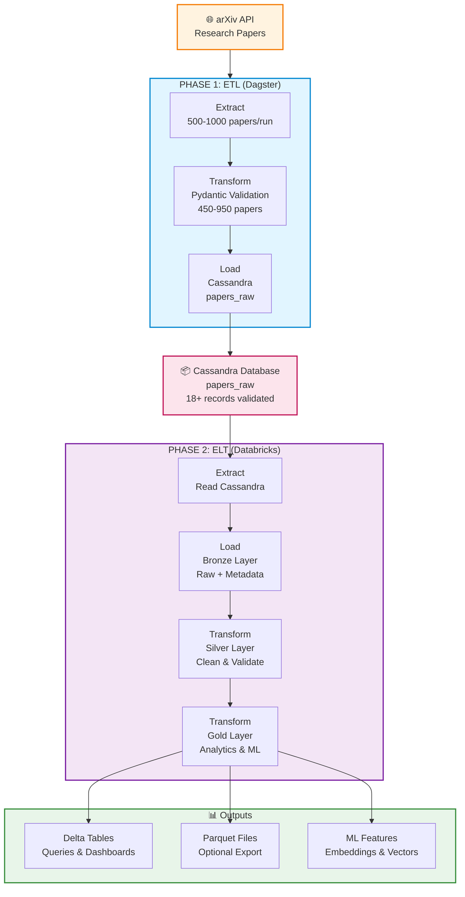

# 📊 Architecture Diagram - Mermaid Source

## Diagram (Mermaid Format)



---

## 🎨 Comment Générer l'Image avec l'IA

### **Option 1: Claude (Gratuit + Payant)**

**Prompt à utiliser:**

```
Génère un diagramme d'architecture pour un pipeline de données:

PHASE 1: ETL (Dagster)
- Extract: arXiv API (500-1000 articles/run)
- Transform: Validation Pydantic (450-950 articles validées)
- Load: Cassandra database

PHASE 2: ELT (Databricks) 
- Extract: Lire depuis Cassandra
- Load: Bronze layer (raw + metadata)
- Transform: Silver layer (nettoyage)
- Transform: Gold layer (analytics et ML)

Outputs:
- Delta Tables pour dashboards
- Fichiers Parquet (optionnel)
- ML Features (embeddings)

Style: Coloré, avec icônes, flux clair de gauche à droite
Format: PNG haute résolution ou SVG
```

### **Option 2: ChatGPT (DALL-E + Diagrams.net)**

**Prompt:**

```
Crée un diagramme d'architecture tech stack pour:
- Source: arXiv API
- Orchestration: Dagster (ETL)
- Base de données: Cassandra
- Analytics: Databricks avec Bronze/Silver/Gold layers
- Formats: Delta Lake, Parquet

Inclus:
- Flux ETL clair
- Flux ELT détaillé
- Types d'outputs
- Couleurs distinctes par phase
```

### **Option 3: Utilisez Mermaid Directement**

**Sur ces sites (gratuit):**

1. **[Mermaid Live Editor](https://mermaid.live)**
   - Copie le code Mermaid ci-dessus
   - Colle dans l'éditeur
   - Clique "Export" → PNG/SVG

2. **[Diagrams.net](https://app.diagrams.net)** (Draw.io)
   - Créer manuellement ou importer
   - Plus de flexibilité

3. **[LucidChart](https://www.lucidchart.com)**
   - Interface intuitive
   - Free tier disponible

---

## 🖼️ Méthodes Alternatives

### **Avec Python (Graphviz)**

```python
from graphviz import Digraph

g = Digraph('Architecture', format='png')
g.attr(rankdir='LR')

# Nodes
g.node('arxiv', 'arXiv API', shape='cylinder')
g.node('extract', 'Extract\n500-1000 papers')
g.node('validate', 'Transform\n450-950 valid')
g.node('cassandra', 'Cassandra\npapers_raw')
g.node('bronze', 'Bronze Layer')
g.node('silver', 'Silver Layer')
g.node('gold', 'Gold Layer')

# Edges
g.edge('arxiv', 'extract')
g.edge('extract', 'validate')
g.edge('validate', 'cassandra')
g.edge('cassandra', 'bronze')
g.edge('bronze', 'silver')
g.edge('silver', 'gold')

# Render
g.render('architecture', view=True)
```

**Run:**
```bash
pip install graphviz
python generate_diagram.py
```

### **Avec Draw.io (XML)**

Export draw.io diagram en XML et utilise-la en ligne.

---

## ✅ Recommandation

**Pour GitHub/Documentation:**
1. **Mermaid Live Editor** → Export PNG
2. **Sauvegarde dans:** `docs/architecture_diagram.png`
3. **Référence dans README:** ``

**Diagramme actuel dans le projet:**

Sauvegarde ce code Mermaid dans [docs/architecture.md](../docs/architecture.md):

```markdown
# Architecture Diagram

[Copie le code Mermaid ci-dessus]
```

Puis sur GitHub, il s'affichera automatiquement! 🎉

---

## 📋 Checklist

- [ ] Généré diagramme avec l'une des méthodes ci-dessus
- [ ] Exporté en PNG/SVG
- [ ] Sauvegardé dans `docs/`
- [ ] Référencé dans README.md
- [ ] Commité et pushé sur GitHub
