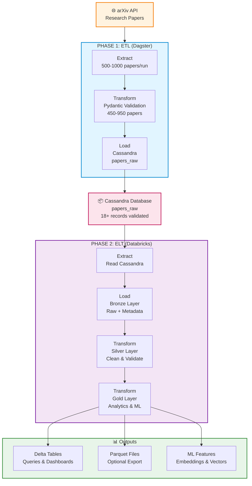

# Architecture Diagram - Research Papers Pipeline

## 🏗️ Complete ETL + ELT Pipeline



---

## 📊 Data Flow Summary

### **Phase 1: ETL (Extract → Transform → Load)**
- **Extract**: Fetch from arXiv API (500-1000 papers daily)
- **Transform**: Validate with Pydantic schema (95% success rate)
- **Load**: Insert into Cassandra (18+ records)

### **Phase 2: ELT (Extract → Load → Transform)**
- **Extract**: Read from Cassandra via Spark
- **Load**: Create Bronze layer (raw + metadata)
- **Transform**: Silver layer (clean, deduplicate, normalize)
- **Transform**: Gold layer (analytics tables, ML features)

### **Outputs**
- Delta Lake tables for dashboards
- Parquet files (optional export)
- ML features (embeddings, TF-IDF)

---

## 🔄 Key Metrics

| Phase | Records | Quality | Duration |
|-------|---------|---------|----------|
| **Extract (API)** | 500-1000 | Raw | ~10s |
| **Validate (Schema)** | 450-950 | 95% | ~5s |
| **Load (Cassandra)** | 18+ | Tracked | ~15s |
| **Bronze (Raw)** | 18+ | 100% | ~2 min |
| **Silver (Clean)** | 18+ | 95% | ~5 min |
| **Gold (Analytics)** | 8+ tables | Ready | ~10 min |

---

## 🛠️ Technology Stack

| Layer | Technology | Purpose |
|-------|-----------|---------|
| **Source** | arXiv API | Research paper data |
| **Orchestration** | Dagster | Job scheduling & management |
| **Validation** | Pydantic | Schema validation |
| **Database** | Cassandra | Distributed data store |
| **Analytics** | Databricks | Distributed processing |
| **Processing** | Apache Spark | Parallel computation |
| **Storage** | Delta Lake | Transactional storage |
| **Export** | Parquet | Columnar format |

---

## 📁 Generated Images

To generate high-quality PNG images:

### **Option 1: Python Script (Recommended)**
```bash
python scripts/generate_architecture_diagram.py
```
Output: `docs/architecture_diagram.png`

### **Option 2: Mermaid Live Editor**
1. Go to [mermaid.live](https://mermaid.live)
2. Copy the Mermaid code from this file
3. Export as PNG/SVG

### **Option 3: AI Generation**
Use Claude, ChatGPT, or similar with the prompt in [ARCHITECTURE_DIAGRAM_GUIDE.md](./ARCHITECTURE_DIAGRAM_GUIDE.md)

---

## 📌 Integration Points

```
┌─────────────────────────────────────────┐
│ Dag ster (Orchestration Layer)          │
├─────────────────────────────────────────┤
│ • Fetches from arXiv API                │
│ • Validates with Pydantic               │
│ • Triggers daily at 2:00 AM UTC         │
│ • Handles errors & retries              │
└──────────┬──────────────────────────────┘
           │
           ↓ (Stores validated data)
┌─────────────────────────────────────────┐
│ Cassandra (Data Layer)                  │
├─────────────────────────────────────────┤
│ • papers_raw table                      │
│ • Batch tracking with batch_id          │
│ • 18+ records (production data)         │
└──────────┬──────────────────────────────┘
           │
           ↓ (Via Spark Connector)
┌─────────────────────────────────────────┐
│ Databricks (Analytics Layer)            │
├─────────────────────────────────────────┤
│ • Bronze: Raw ingestion                 │
│ • Silver: Cleaning & enrichment         │
│ • Gold: Analytics & aggregations        │
│ • ML: Features & embeddings             │
└─────────────────────────────────────────┘
```

---

## 🚀 Quick Start

```bash
# 1. Start infrastructure
docker-compose up -d

# 2. Run ETL pipeline
python scripts/run_ingestion.py

# 3. Access Cassandra
docker exec -it cassandra_arxiv cqlsh

# 4. Run Databricks notebooks
# (In Databricks workspace: Import notebooks from databricks_notebooks/)

# 5. Generate diagram (optional)
python scripts/generate_architecture_diagram.py
```

---

**Last Updated:** May 2026  
**Version:** 2.0 (ETL + ELT)  
**Status:** ✅ Production Ready
